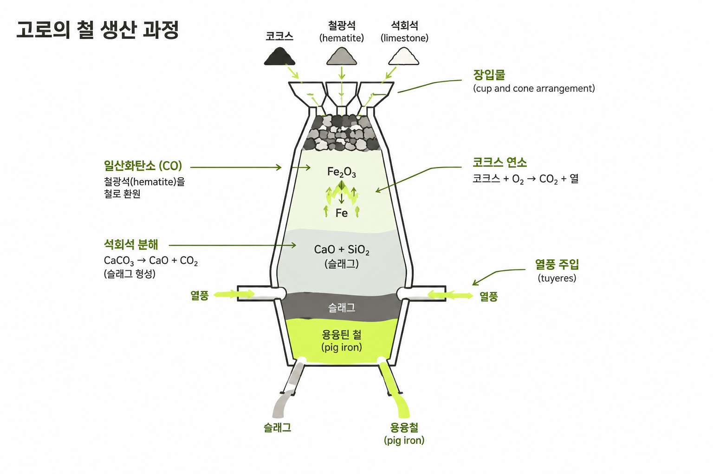

제선이란?

**제선(製銑)**은 철광석에서 산소와 불순물을 제거해 **쇳물(용선, hot metal)**을 만드는 공정입니다. 철광석은 철과 산소가 결합한 산화철 형태이므로, 산소를 떼어내는 환원과 철을 녹이는 용융이 함께 필요합니다. 만들어진 쇳물은 다음 단계인 제강 공정에서 탄소와 불순물을 조절해 강철로 바뀝니다.

포스코의 철강 생산 공정 설명: https://newsroom.posco.com/en/steel-made/

용광로에서 철이 생산되는 핵심 과정은 무엇인가? 용광로에서는 코크스가 연소하며 생성된 일산화탄소가 산화철을 환원시켜 순수한 철을 얻는 과정이 핵심입니다.

1. 용광로에서의 철 생산 과정
   

용광로에서는 코크스 연소를 통해 생성된 일산화탄소가 산화철을 환원시켜 순수한 철을 얻는 과정이 핵심이다.

1.1. 용광로 작동 단계별 과정
captureSource
원료 투입: 용광로 상부의 컵과 콘 장치를 통해 원료가 투입된다.

열풍 공급: 동시에 뜨거운 공기(열풍)가 취관을 통해 용광로 안으로 공급된다.

코크스 연소: 투입된 코크스는 뜨거운 공기와 반응하여 연소하며, 이 과정에서 이산화탄소가 생성되고 많은 열이 발생한다.

일산화탄소 생성: 생성된 이산화탄소는 위로 올라가면서 투입되는 코크스와 다시 반응하여 일산화탄소를 생성한다.

산화철 환원: 강력한 환원제인 일산화탄소는 산화철(적철석)을 환원시킨다.

석회석 분해: 이 과정에서 발생하는 열로 인해 석회석이 분해된다.

석회석은 분해되어 산화칼슘과 이산화탄소를 생성한다.

슬래그 형성: 생성된 생석회(산화칼슘)는 용제 역할을 하며, 불순물인 모래(규산)와 결합하여 규산칼슘으로 변환된다.

이 규산칼슘은 녹기 쉬운 덩어리를 형성하는데, 이를 슬래그라고 한다.

철과 슬래그 분리: 환원되어 생성된 철은 용광로 하부에 모이고, 슬래그는 그 위에 층을 형성하여 녹은 철이 산화되는 것을 막아준다.

1.2. 생산된 철의 특징
captureSource
선철 생산: 이 과정을 통해 얻어진 철을 선철이라고 한다.

불순물 포함: 선철에는 탄소가 불순물로 포함되어 있다.

제선과 제강의 차이

- 제선: 철광석을 환원·용융해 쇳물(용선)을 만듭니다.
- 제강: 쇳물의 탄소·인·황 등 성분을 조절하고 불순물을 제거해 강철(용강)을 만듭니다.
